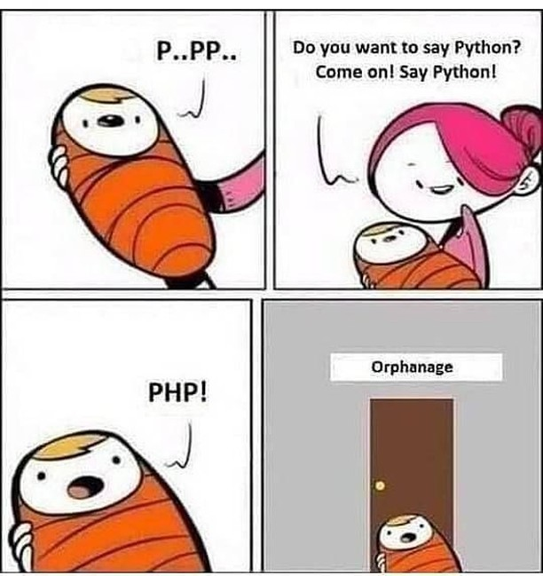

# Igor de Jesus

- 👩‍💻 Back-End Developer
- 🎓 Computer Science Student @ [IFB](https://www.ifb.edu.br/taguatinga)
- 🌐 Passionate about web development
- 💡 Love a good challenge

<h2 align="left">Techs</h2>

  
  
  
  
  
  
  
  
  
  
  
  
  

<h2 align="left">Stats</h2>

  
  

